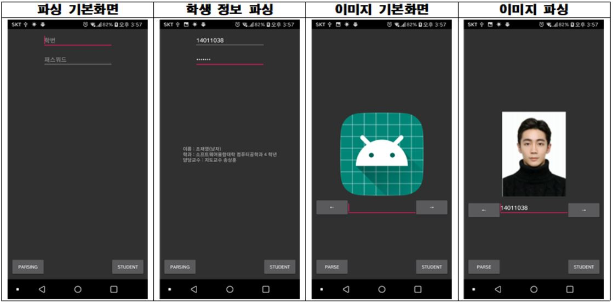

# Parsing  

  

### 1. Udream 세션으로 로그인 이후 페이지 Parsing (JSoup)  

<hr>  

## [Parser](https://github.com/zojae031/Parsing/blob/master/Crawling/app/src/main/java/crawling/example/util/Parser.kt)
#### 1. 해당 url로 접근하여 기본 세션을 가져온다.  ``Line 22~26``  
 - 로그인 페이지에 세션을 하나 먼저 줌  
#### 2. 로그인 폼을 만들어 정보를 입력하고 제출한다. ``Line 28~41``  
#### 3. 중간 페이지에 추가세션이 있는데 추가세션을 구한다. ``Line44~48``  
 - 크롬 개발자도구인 ``EditThisCookie``등을 사용하면 세션정보를 확인 할 수 있다.  
 예제에 사용된 페이지같은 경우는 html로 던져주어 직접 함수를 만들어서 Map형식에 담아 세션에 추가하였다.  
#### 4. 사용자 정보를 크롤링하여 핸들러를 통해 Presenter로 전송한다. ``Line 51~63``  

```kotlin
 fun parse(handler: Handler, id: String, pw: String) {
        Thread {
            val msg = handler.obtainMessage()

            // 첫 페이지 세션 얻어오기
            val res = Jsoup.connect(url)
                .method(Connection.Method.GET)
                .execute()

            val session = res.cookies()
            //로그인 폼 얻어오기
            val form = res.parse().select("form").first() as FormElement

            //폼에 해당하는 값 저장
            with(form.select("input")) {
                select("[name=rUserid]").`val`(id)
                select("[name=rPW]").`val`(pw)
                select("[name=pro]").`val`("1")
            }

            //첫번째 세션을 통해 제출
            val result = form
                .submit()
                .cookies(session)
                .post()

            // 두번째 페이지에 해당하는 세션 얻어오기
            try {
                session += findSessionIndex(result.html())
            }catch (e: StringIndexOutOfBoundsException) {
                e.printStackTrace()
            }

            //사용자 정보 크롤링
            val privateData =
                Jsoup.connect("https://udream.sejong.ac.kr/Office/Teacher/ProfileGetData.aspx?mode=2&pid=N")
                    .cookies(session)
                    .method(Connection.Method.POST)
                    .execute()

            val data = privateData.parse().select("div")
            // 핸들러를 통해 MainThread로 전송
            val bundle = Bundle()
            bundle.putSerializable("html", data)

            msg.data = bundle
            handler.sendMessage(msg)
        }.start()
    }
        @Throws(StringIndexOutOfBoundsException::class)
    fun findSessionIndex(html: String): MutableMap<String, String> {
        val idx = html.indexOf(SecondSession1)
        var lastIdx = idx
        var arr = String()

        while (html[lastIdx] != ';') {
            lastIdx++
        }

        for (i in idx + SecondSession1.length until lastIdx) {
            arr += html[i]
        }

        return mutableMapOf(SecondSession1 to arr, SecondSession2 to "1", SecondSession3 to "1")
    }
    
```  
    
<hr>  

### 2. 세종대학교 학번으로 학생 사진 가져오기 (Glide)  

